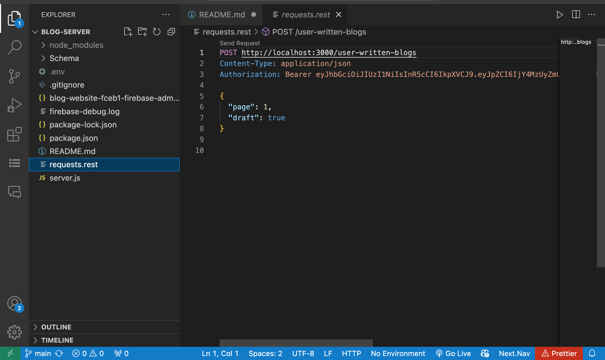

# node-blog-server
This is a blog web service made with Express the Node.js framework



## 🔧 Built With

- Node.Js
- Express
- bcrypt

## 🔴 Live Demo

try send query with postman to Live-link

[Live-link](https://blog-server-b1gn.onrender.com/)


## 🛠 Getting Started

To get a local copy up and running follow these simple example steps.

- Go to the main page of te repo.
- Press the ```Code``` button and get the repo link.
- Clone it using git.

## ✒️ Authors

👤 **Cecilia Benitez**

- [@Ceci007](https://github.com/Ceci007)


## 🤝 Contributing

Contributions, issues and feature requests are welcome!

Feel free to check the [issues page](https://github.com/Ceci007/blog-server/issues).

## 📝 License

This project is [MIT](lic.url) licensed.